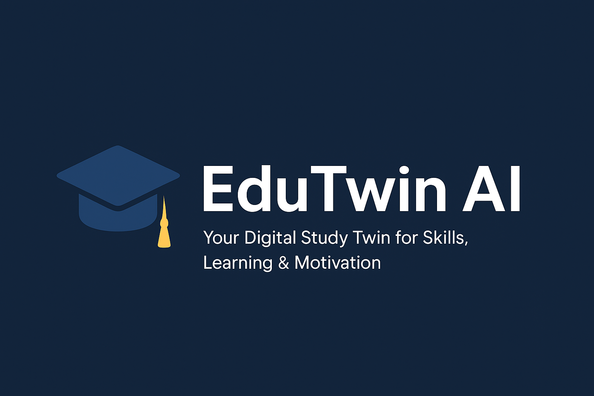

# 🎓 EduTwin AI  

<p align="center">
  
</p>

<p align="center"><i>Your Digital Study Twin for Skills, Learning & Motivation</i></p>

<p align="center"> 
  <a href="https://www.python.org/">
    
  </a> 
  <a href="https://streamlit.io/">
    
  </a> 
  <a href="LICENSE">
    
  </a> 
  <a href="https://github.com/aansheeagrwal/EduTwin-AI/stargazers">
    
  </a> 
</p>

---

## 🌟 Overview  

**EduTwin AI** is a **Streamlit-based digital twin mentor** for students.  
It helps track **skills, learning progress, tasks, moods**, and provides **AI-powered mentorship, mock interviews, and file-based study guidance** for smarter learning.  

Think of it as your **study twin** that grows with you. ✨  

---

## 🚀 Features  

### 👤 Profile & Skills  
- Add and track your skills with proficiency levels  
- Visualize growth over time  

### 📚 Learning Progress  
- Track courses, topics, and completion status  
- AI suggests what to study next  

### ✅ Task Manager  
- Add daily/weekly study goals  
- Stay motivated with progress tracking  

### 😊 Mood & Motivation  
- Log your daily mood  
- Get motivational quotes & personalized tips  

### 🤖 AI-Powered Mentorship  
- Mock interviews for career prep  
- AI career guidance & Q&A  
- Upload study files for AI-driven insights  

---

## 🛠️ Tech Stack  

- **Frontend**: [Streamlit](https://streamlit.io/)  
- **Backend**: Python (3.10+)  
- **AI/ML**: OpenAI / Gemini API (for mentorship & mock interviews)  
- **Data Storage**: Local JSON / SQLite  

---

## ⚡ Installation  

Clone the repository:  
```bash
git clone https://github.com/aansheeagrwal/EduTwin-AI.git
cd EduTwin-AI
```

## Install dependencies:
```bash
pip install -r requirements.txt
```

## Run the app:

```bash
streamlit run app.py
```
---
## 📸 Screenshots

---

## 🤝 Contributing
Contributions are welcome! 🎉

1. Fork the repo
2. Create a new branch (feature-xyz)
3. Commit changes
4. Open a Pull Request

---
## 📜 License

This project is licensed under the MIT License – see the LICENSE
 file for details.

---
## ⭐ Support

If you like this project, don’t forget to star the repo ⭐
It keeps me motivated to build more!

<p align="center">Made with ❤️ by <a href="https://github.com/aansheeagrwal">Anshi Goyal</a></p> ```